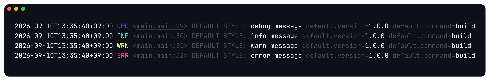
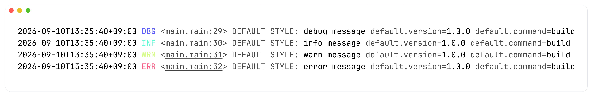

<p align="center">
  
</p>
<h1 align="center">LOG</h1>

<p align="center">A fast, zero-allocation slog handler for Go CLIs</p>
<p align="center">
  <a href="https://github.com/nekrassov01/log/actions/workflows/ci.yml"></a>
  <a href="https://pkg.go.dev/github.com/nekrassov01/log"></a>
  
</p>

## Table of contents

- [Overview](#overview)
- [Features](#features)
- [Installation](#installation)
- [Quick start](#quick-start)
- [Customization](#customization)
- [Performance](#performance)
  - [Results](#results)
  - [Workloads](#workloads)
  - [Measurement boundaries](#measurement-boundaries)
  - [Running](#running)
  - [Raw results](#raw-results)
- [Author](#author)
- [License](#license)

## Overview

`nekrassov01/log` provides `CLIHandler`, a `log/slog` handler for readable CLI output. Use it with `slog.Logger` to display messages, attributes, and groups with compact level labels. Colors are enabled automatically for terminals and omitted for files and pipes.

The visual style is inspired by [charmbracelet/log](https://github.com/charmbracelet/log).

## Features

CLI-focused output with structured logging support:

- Native `log/slog` integration
- Zero-allocation hot paths
- Terminal-aware colors with Windows support
- Custom styles and log levels
- Nested attributes and selective redaction
- Concurrent-safe handler and derived loggers

## Installation

Install with:

```sh
go get github.com/nekrassov01/log@latest
```

## Quick start

Use the default style to show CLI execution details alongside timestamps, source functions, and a label:

```go
package main

import (
	"log/slog"
	"os"

	"github.com/nekrassov01/log"
)

func main() {
	handler := log.NewCLIHandler(os.Stdout,
		log.WithTime(),
		log.WithLevel(slog.LevelDebug),
		log.WithSourceFunction(),
		log.WithLabel("DEFAULT STYLE:"),
	)
	logger := slog.New(handler).
		WithGroup("default").
		With(
			slog.String("version", "1.0.0"),
			slog.String("command", "build"),
		)
	logger.Debug("debug message")
	logger.Info("info message")
	logger.Warn("warn message")
	logger.Error("error message")
}
```

The default-style output from [examples/main.go](./examples/main.go), shown on dark and light backgrounds:





The default minimum level is `INFO`. Time, source, and label output are opt-in; the default output contains the level, message, and any attributes.

## Customization

Configure output, appearance, and attribute replacement through separate options:

- Add `WithTime()`, `WithSourceFunction()` or `WithSourcePath()`, and `WithLabel()` for context.
- Use `WithStyle(NewStyle(...))` to customize colors, affixes, level text, alignment, and attribute separators.
- Use `WithAttrReplacer()` to redact, transform, or remove ordinary attributes, including nested ones.

For example, change the message color while keeping the remaining default styles:

```go
handler := log.NewCLIHandler(os.Stdout,
	log.WithStyle(log.NewStyle(
		log.WithMessageStyle(log.MessageStyle{
			Color: log.NewColor(log.CodeFgCyan),
		}),
	)),
)
```

Built-in time, level, source, label, and message are styled separately and do not pass through the attribute replacer.

If a shared request logger attaches a `request_body` attribute that your application does not need, omit it at the handler:

```go
handler := log.NewCLIHandler(os.Stdout,
	log.WithAttrReplacer(func(_ []string, attr slog.Attr) slog.Attr {
		if attr.Key == "request_body" {
			return slog.Attr{}
		}
		return attr
	}),
)
```

This removes the named attribute, not sensitive content in messages or other attributes. Avoid logging secrets at their source whenever possible.

See [examples/main.go](./examples/main.go) and the [API reference](https://pkg.go.dev/github.com/nekrassov01/log).

## Performance

The serial benchmarks below show zero-allocation writes with all built-in output enabled and with 64 preformatted attributes.

Attach repeated attributes with `Logger.With` to format them once and reuse the output. For attributes that change on each write, `Logger.LogAttrs` accepts typed values directly.

### Results

Representative serial results on Apple M2, darwin/arm64. Each value is the median of three runs of 100,000 iterations.

| Workload                                         | allocs/op | ns/op | B/op |
| ------------------------------------------------ | --------: | ----: | ---: |
| Level and message                                |         0 | 229.9 |    0 |
| Time, level, source function, label, and message |         0 | 265.4 |    0 |
| 5 integer attributes per write                   |         0 | 354.2 |    0 |
| 6 integer attributes per write                   |         1 | 407.5 |   48 |
| 64 preformatted integer attributes               |         0 | 249.9 |    0 |

Measured with `io.Discard`, excluding terminal colors, output locking, and operating-system I/O. Input construction and handler setup are outside the timed loop.

Zero allocation is workload-dependent: `slog.Record` allocates storage beyond five top-level attributes per write. `Any` formatting, `LogValuer` implementations, and outputs exceeding retained buffer capacities can also allocate.

### Workloads

The suite follows the workload categories in [zerolog's benchmarks](https://github.com/rs/zerolog/blob/master/benchmark_test.go), adapted to `slog` and CLI output. It is not an output-equivalent comparison with zerolog's JSON encoding.

Each benchmark family measures a different part of log handling:

| Benchmark suffix | Measured work                                                                                  |
| ---------------- | ---------------------------------------------------------------------------------------------- |
| `Disabled`       | Level filtering with and without supplied attributes                                           |
| `Message`        | Empty, escaped, Unicode, invalid UTF-8, and large messages                                     |
| `BuiltIns`       | Optional time, source path, source function, and label output                                  |
| `AttrType`       | Scalars, groups, `LogValuer`, and `Any` values                                                 |
| `AttrCount`      | Flat attribute lists, including the five-to-six attribute allocation boundary in `slog.Record` |
| `GroupDepth`     | Per-write traversal of nested attribute groups, with one leaf at every depth                   |
| `AttrReplacer`   | No replacement, identity, redaction, removal, and expansion into a group                       |
| `WithAttrs`      | Handler derivation and attribute preformatting, without writing a record                       |
| `Parallel`       | Shared-handler throughput, with and without the output lock                                    |

### Measurement boundaries

Benchmark inputs, case tables, mock types, and shared helpers live in [benchmarks/helper_test.go](./benchmarks/helper_test.go). The benchmark functions contain setup and timed operations.

- `AttrsAtSetup` measures writes after attributes have been preformatted. Setup is not timed.
- `AttrsAtWrite` measures attribute resolution and formatting on every write. Input attributes are constructed before timing.
- `WithAttrs` measures setup itself, appending attributes to a handler that already has one cached attribute.
- `AttrType` excludes input construction and initial `Any` boxing. `LogValuer` resolution and any values it creates are timed.
- Source benchmarks repeatedly use the same logging call site; they primarily measure cached lookups.
- `Parallel/Discard` bypasses the handler's output lock. `Parallel/Writer` uses a stateless writer that exercises that lock without operating-system I/O. Parallel `ns/op` measures aggregate throughput, not individual call latency.
- Writers are not terminals. Terminal colors, console I/O, and Windows translation are not measured.
- Large messages and deep groups can exceed the pool's capacity limits and require allocations on subsequent writes.

### Running

Reproduce the benchmark families summarized in [Results](#results):

```sh
go test -run '^$' -bench '^BenchmarkCLIHandler_(BuiltIns|AttrCount)$' -benchmem -benchtime=100000x -count=3 ./benchmarks
```

Run every case with a fixed iteration count:

```sh
go test -run '^$' -bench . -benchmem -benchtime=100000x -count=3 ./benchmarks
```

Run only the attribute-count cases:

```sh
go test -run '^$' -bench '^BenchmarkCLIHandler_AttrCount$' -benchmem -benchtime=100000x -count=3 ./benchmarks
```

Run parallel cases with different processor counts:

```sh
go test -run '^$' -bench '^BenchmarkCLIHandler_Parallel$' -benchmem -cpu=1,2,4 -count=3 ./benchmarks
```

### Raw results

Full output for the `BuiltIns` and `AttrCount` benchmark families, including all three runs:

```powershell
goos: darwin
goarch: arm64
pkg: github.com/nekrassov01/log/benchmarks
cpu: Apple M2
BenchmarkCLIHandler_BuiltIns/None-8               100000  232.1 ns/op      0 B/op  0 allocs/op
BenchmarkCLIHandler_BuiltIns/None-8               100000  229.9 ns/op      0 B/op  0 allocs/op
BenchmarkCLIHandler_BuiltIns/None-8               100000  220.8 ns/op      0 B/op  0 allocs/op
BenchmarkCLIHandler_BuiltIns/Time-8               100000  250.2 ns/op      0 B/op  0 allocs/op
BenchmarkCLIHandler_BuiltIns/Time-8               100000  252.1 ns/op      0 B/op  0 allocs/op
BenchmarkCLIHandler_BuiltIns/Time-8               100000  246.4 ns/op      0 B/op  0 allocs/op
BenchmarkCLIHandler_BuiltIns/SourcePath-8         100000  222.5 ns/op      0 B/op  0 allocs/op
BenchmarkCLIHandler_BuiltIns/SourcePath-8         100000  224.2 ns/op      0 B/op  0 allocs/op
BenchmarkCLIHandler_BuiltIns/SourcePath-8         100000  222.2 ns/op      0 B/op  0 allocs/op
BenchmarkCLIHandler_BuiltIns/SourceFunction-8     100000  222.8 ns/op      0 B/op  0 allocs/op
BenchmarkCLIHandler_BuiltIns/SourceFunction-8     100000  221.6 ns/op      0 B/op  0 allocs/op
BenchmarkCLIHandler_BuiltIns/SourceFunction-8     100000  223.0 ns/op      0 B/op  0 allocs/op
BenchmarkCLIHandler_BuiltIns/Label-8              100000  218.5 ns/op      0 B/op  0 allocs/op
BenchmarkCLIHandler_BuiltIns/Label-8              100000  217.4 ns/op      0 B/op  0 allocs/op
BenchmarkCLIHandler_BuiltIns/Label-8              100000  221.2 ns/op      0 B/op  0 allocs/op
BenchmarkCLIHandler_BuiltIns/All-8                100000  264.8 ns/op      0 B/op  0 allocs/op
BenchmarkCLIHandler_BuiltIns/All-8                100000  265.4 ns/op      0 B/op  0 allocs/op
BenchmarkCLIHandler_BuiltIns/All-8                100000  275.8 ns/op      0 B/op  0 allocs/op
BenchmarkCLIHandler_AttrCount/0/AttrsAtSetup-8    100000  229.9 ns/op      0 B/op  0 allocs/op
BenchmarkCLIHandler_AttrCount/0/AttrsAtSetup-8    100000  216.9 ns/op      0 B/op  0 allocs/op
BenchmarkCLIHandler_AttrCount/0/AttrsAtSetup-8    100000  212.8 ns/op      0 B/op  0 allocs/op
BenchmarkCLIHandler_AttrCount/0/AttrsAtWrite-8    100000  217.4 ns/op      0 B/op  0 allocs/op
BenchmarkCLIHandler_AttrCount/0/AttrsAtWrite-8    100000  595.3 ns/op      0 B/op  0 allocs/op
BenchmarkCLIHandler_AttrCount/0/AttrsAtWrite-8    100000  214.1 ns/op      0 B/op  0 allocs/op
BenchmarkCLIHandler_AttrCount/1/AttrsAtSetup-8    100000  216.2 ns/op      0 B/op  0 allocs/op
BenchmarkCLIHandler_AttrCount/1/AttrsAtSetup-8    100000  214.9 ns/op      0 B/op  0 allocs/op
BenchmarkCLIHandler_AttrCount/1/AttrsAtSetup-8    100000  221.5 ns/op      0 B/op  0 allocs/op
BenchmarkCLIHandler_AttrCount/1/AttrsAtWrite-8    100000  251.7 ns/op      0 B/op  0 allocs/op
BenchmarkCLIHandler_AttrCount/1/AttrsAtWrite-8    100000  252.0 ns/op      0 B/op  0 allocs/op
BenchmarkCLIHandler_AttrCount/1/AttrsAtWrite-8    100000  249.6 ns/op      0 B/op  0 allocs/op
BenchmarkCLIHandler_AttrCount/4/AttrsAtSetup-8    100000  216.7 ns/op      0 B/op  0 allocs/op
BenchmarkCLIHandler_AttrCount/4/AttrsAtSetup-8    100000  217.4 ns/op      0 B/op  0 allocs/op
BenchmarkCLIHandler_AttrCount/4/AttrsAtSetup-8    100000  221.4 ns/op      0 B/op  0 allocs/op
BenchmarkCLIHandler_AttrCount/4/AttrsAtWrite-8    100000  335.6 ns/op      0 B/op  0 allocs/op
BenchmarkCLIHandler_AttrCount/4/AttrsAtWrite-8    100000  334.8 ns/op      0 B/op  0 allocs/op
BenchmarkCLIHandler_AttrCount/4/AttrsAtWrite-8    100000  331.4 ns/op      0 B/op  0 allocs/op
BenchmarkCLIHandler_AttrCount/5/AttrsAtSetup-8    100000  215.0 ns/op      0 B/op  0 allocs/op
BenchmarkCLIHandler_AttrCount/5/AttrsAtSetup-8    100000  216.9 ns/op      0 B/op  0 allocs/op
BenchmarkCLIHandler_AttrCount/5/AttrsAtSetup-8    100000  221.1 ns/op      0 B/op  0 allocs/op
BenchmarkCLIHandler_AttrCount/5/AttrsAtWrite-8    100000  354.2 ns/op      0 B/op  0 allocs/op
BenchmarkCLIHandler_AttrCount/5/AttrsAtWrite-8    100000  359.3 ns/op      0 B/op  0 allocs/op
BenchmarkCLIHandler_AttrCount/5/AttrsAtWrite-8    100000  353.6 ns/op      0 B/op  0 allocs/op
BenchmarkCLIHandler_AttrCount/6/AttrsAtSetup-8    100000  217.1 ns/op      0 B/op  0 allocs/op
BenchmarkCLIHandler_AttrCount/6/AttrsAtSetup-8    100000  222.4 ns/op      0 B/op  0 allocs/op
BenchmarkCLIHandler_AttrCount/6/AttrsAtSetup-8    100000  218.4 ns/op      0 B/op  0 allocs/op
BenchmarkCLIHandler_AttrCount/6/AttrsAtWrite-8    100000  736.1 ns/op     48 B/op  1 allocs/op
BenchmarkCLIHandler_AttrCount/6/AttrsAtWrite-8    100000  406.3 ns/op     48 B/op  1 allocs/op
BenchmarkCLIHandler_AttrCount/6/AttrsAtWrite-8    100000  407.5 ns/op     48 B/op  1 allocs/op
BenchmarkCLIHandler_AttrCount/16/AttrsAtSetup-8   100000  221.2 ns/op      0 B/op  0 allocs/op
BenchmarkCLIHandler_AttrCount/16/AttrsAtSetup-8   100000  222.2 ns/op      0 B/op  0 allocs/op
BenchmarkCLIHandler_AttrCount/16/AttrsAtSetup-8   100000  224.7 ns/op      0 B/op  0 allocs/op
BenchmarkCLIHandler_AttrCount/16/AttrsAtWrite-8   100000  733.1 ns/op    448 B/op  1 allocs/op
BenchmarkCLIHandler_AttrCount/16/AttrsAtWrite-8   100000  773.7 ns/op    448 B/op  1 allocs/op
BenchmarkCLIHandler_AttrCount/16/AttrsAtWrite-8   100000  810.4 ns/op    448 B/op  1 allocs/op
BenchmarkCLIHandler_AttrCount/64/AttrsAtSetup-8   100000  249.9 ns/op      0 B/op  0 allocs/op
BenchmarkCLIHandler_AttrCount/64/AttrsAtSetup-8   100000  255.3 ns/op      0 B/op  0 allocs/op
BenchmarkCLIHandler_AttrCount/64/AttrsAtSetup-8   100000  245.9 ns/op      0 B/op  0 allocs/op
BenchmarkCLIHandler_AttrCount/64/AttrsAtWrite-8   100000   2216 ns/op   2689 B/op  1 allocs/op
BenchmarkCLIHandler_AttrCount/64/AttrsAtWrite-8   100000   2200 ns/op   2689 B/op  1 allocs/op
BenchmarkCLIHandler_AttrCount/64/AttrsAtWrite-8   100000   2208 ns/op   2689 B/op  1 allocs/op
BenchmarkCLIHandler_AttrCount/256/AttrsAtSetup-8  100000  256.0 ns/op      0 B/op  0 allocs/op
BenchmarkCLIHandler_AttrCount/256/AttrsAtSetup-8  100000  254.5 ns/op      0 B/op  0 allocs/op
BenchmarkCLIHandler_AttrCount/256/AttrsAtSetup-8  100000  255.4 ns/op      0 B/op  0 allocs/op
BenchmarkCLIHandler_AttrCount/256/AttrsAtWrite-8  100000   8407 ns/op  10249 B/op  1 allocs/op
BenchmarkCLIHandler_AttrCount/256/AttrsAtWrite-8  100000   8469 ns/op  10249 B/op  1 allocs/op
BenchmarkCLIHandler_AttrCount/256/AttrsAtWrite-8  100000   8757 ns/op  10248 B/op  1 allocs/op
PASS
ok    github.com/nekrassov01/log/benchmarks  5.346s
```

## Author

[nekrassov01](https://github.com/nekrassov01)

## License

[MIT](./LICENSE)
